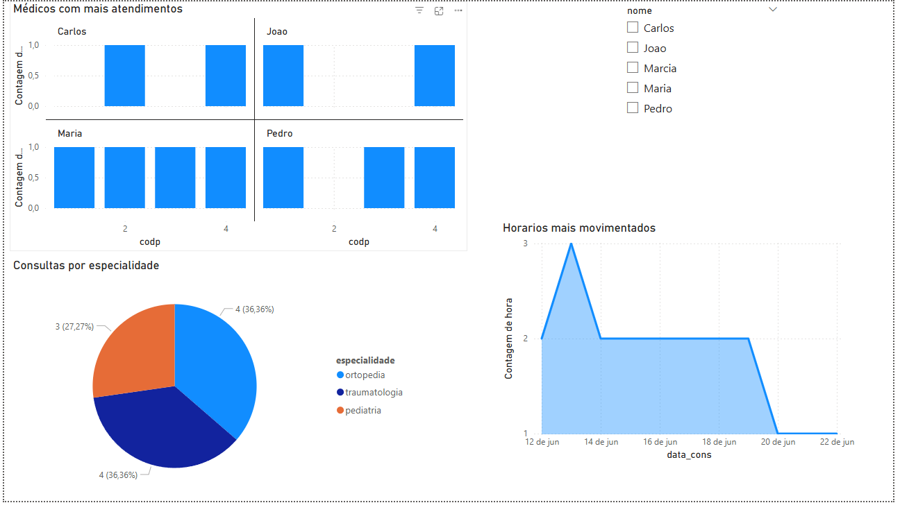

# 📊 Clínica Data Analysis

## 📝 Descrição

Projeto de análise de dados de uma clínica médica utilizando MySQL para modelagem do banco de dados e Power BI para criação de dashboards interativos.

O projeto simula um cenário real de negócio, permitindo analisar informações sobre pacientes, médicos, consultas, especialidades e faturamento.

---

## 🛠️ Tecnologias utilizadas

* MySQL
* Power BI

---

## 🔄 Pipeline de dados

1. Criação do banco de dados no MySQL
2. Modelagem das tabelas (pacientes, médicos, consultas, etc.)
3. Inserção e tratamento dos dados
4. Consultas SQL para extração de informações
5. Importação dos dados no Power BI
6. Desenvolvimento do dashboard interativo

---

## 📊 Análises realizadas

* Quantidade de consultas por período
* Médicos com maior número de atendimentos
* Especialidades mais demandadas
* Pacientes mais frequentes
* Distribuição por idade
* Faturamento por cidade e funcionário
* Horários com maior volume de consultas

---

## 📸 Dashboard


### 👨‍⚕️ Análise de Consultas




---

## 📁 Estrutura do projeto

```
clinica-data-analysis/
│
├── sql/
│   ├── schema.sql
│   ├── inserts.sql
│   └── consultas.sql
│
├── powerbi/
│   └── clinica.pbix
│
├── imagens/
│   ├── dashboard-geral.png
│   ├── analise-consultas.png
│   ├── analise-pacientes.png
│   └── indicadores.png
│
└── README.md
```

---

## 🎯 Objetivo

Demonstrar habilidades práticas em:

* Modelagem de dados
* Consultas SQL
* Análise de dados
* Criação de dashboards interativos

---

## 🚀 Possíveis melhorias

* Integração com Python para análise de dados
* Automação do processo de ETL
* Criação de novos indicadores e métricas
* Aplicação de modelagem dimensional (Star Schema)

---

## 👨‍💻 Autor

Marcos Vinícius
